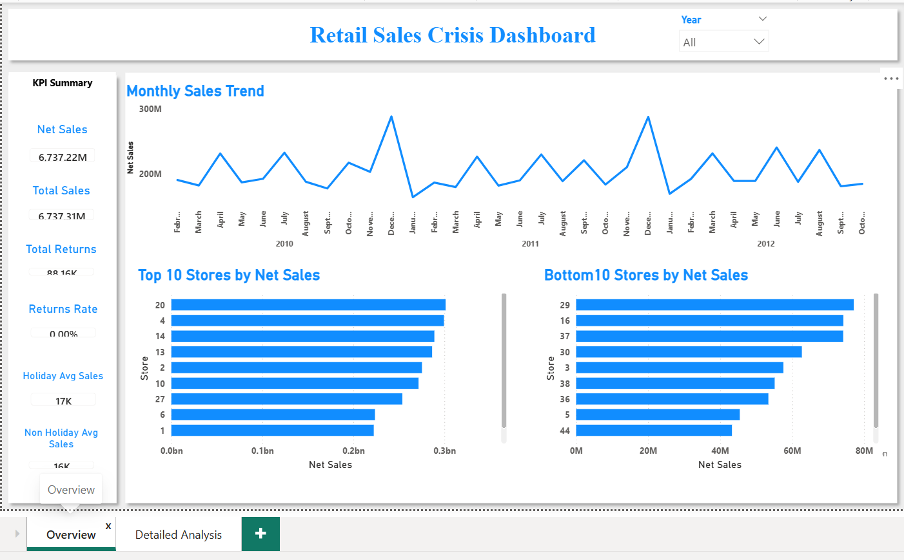

# Retail Sales Crisis Dashboard

## Project Overview
This project analyzes retail sales performance using Power BI and SQL. The dashboard helps identify sales trends, store-level performance, risk categories, and business improvement areas.

## Tools Used
- Power BI
- DAX
- SQL
- Excel / CSV

## Key KPIs
- Net Sales
- Total Sales
- Total Returns
- Return Rate
- Sales Growth %
- Risk Category

## Dashboard Pages
1. Overview Dashboard
2. Detailed Analysis Dashboard

## Key Insights
- Sales show monthly volatility with multiple sharp drops.
- Most stores are stable, but some stores fall under moderate or high-risk categories.
- Store-level sales performance varies significantly.
- Non-holiday sales performance needs improvement.

## Recommendations
- Monitor high-risk stores monthly.
- Run targeted promotions during weak sales months.
- Improve performance of underperforming stores.
- Analyze return and demand patterns for stores with repeated sales drops.

## Dashboard Preview

### Overview

### Detailed Analysis

